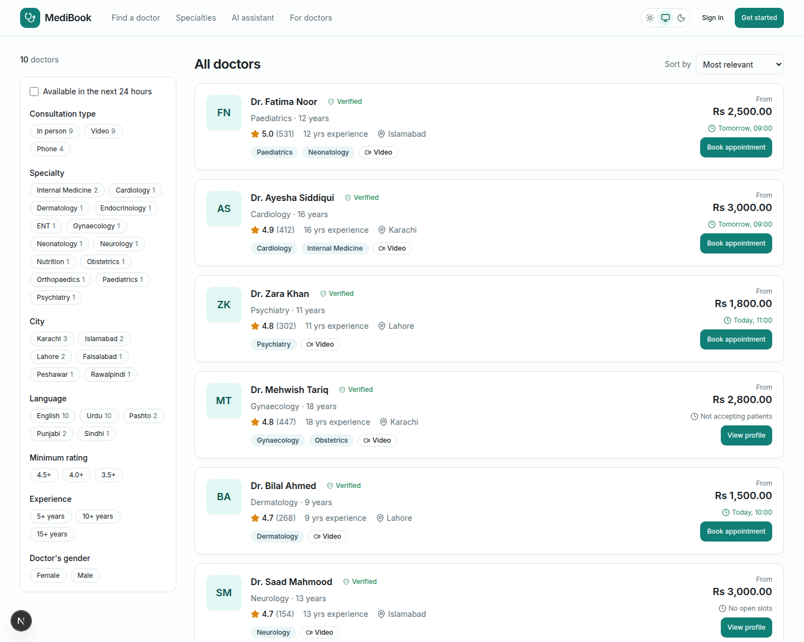
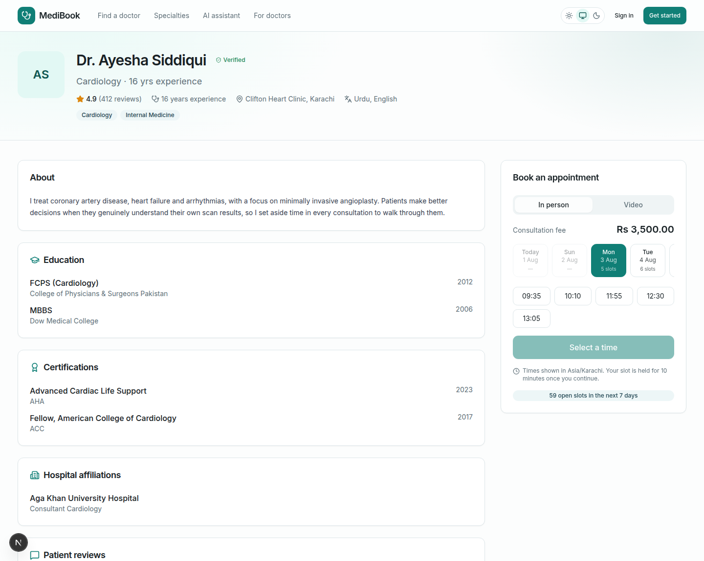
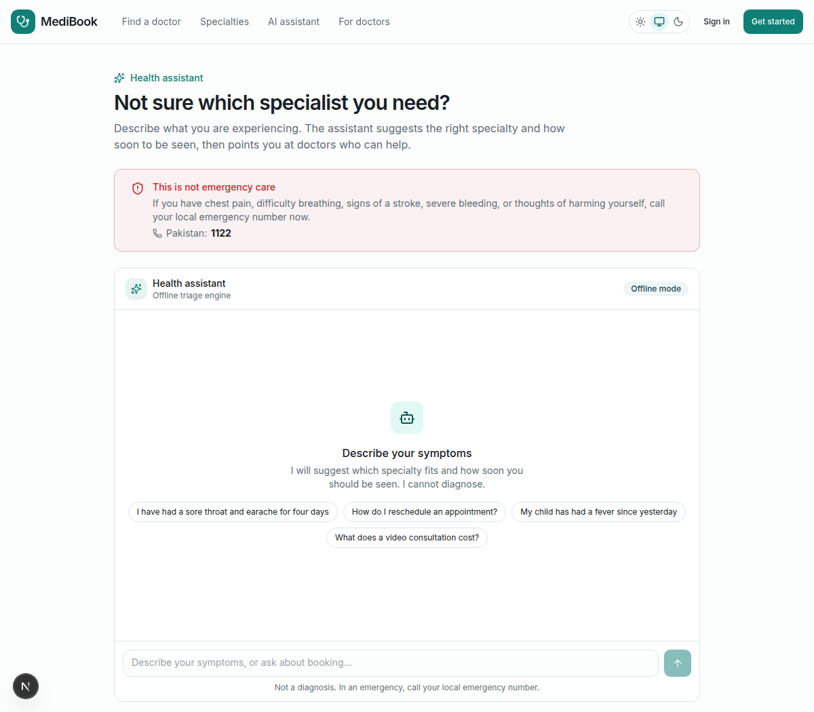
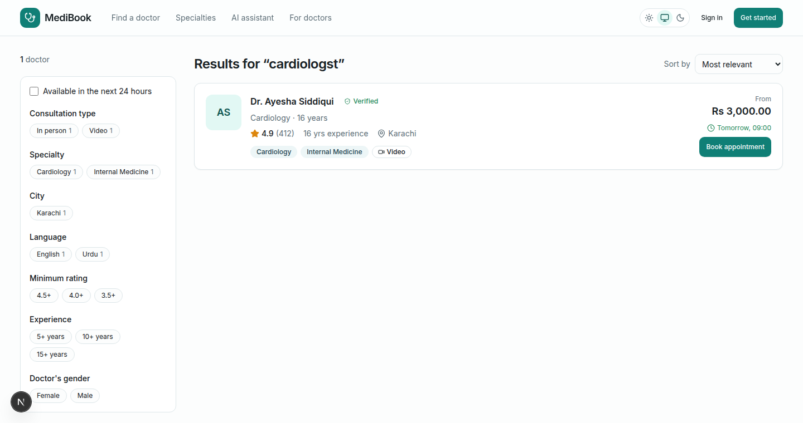

# doctor-booking-platform

An offline-first healthcare marketplace: patients search verified doctors, compare real
availability, and book in-person or video consultations. Doctors manage their schedules; admins
verify credentials.

**It runs with zero third-party accounts.** Payments, SMS, email, video and AI all resolve to
local drivers by default. The production drivers are written and sit in the same tree — they
activate on an environment variable, not a code change.

---

## Quick start

```bash
git clone <repo> && cd doctor-booking-platform
cp .env.example .env                 # defaults work as-is for local development
npm install
docker compose up -d                 # Postgres, Redis, Meilisearch, Ollama
npm run db:migrate                   # create the schema
npm run db:seed                      # 12 doctors, patients, appointments, reviews
npm run dev                          # http://localhost:3000
```

Or `npm run setup`, which chains install → compose → migrate → seed.

### Seeded accounts

All use the password `Passw0rd!23`.

| Role | Email |
| --- | --- |
| Super admin | `admin@medibook.test` |
| Admin | `reviewer@medibook.test` |
| Doctor | `ayesha.siddiqui@medibook.test` |
| Patient | `hina.rauf@medibook.test` |

### No Docker yet?

Set `DEMO_MODE=true` in `.env` and run `npm run dev`. The marketplace serves from an in-memory
repository behind the same interface Postgres uses, so the public pages work before any
infrastructure exists. Anything that writes (booking, auth, portals) still needs the database.

---

## Current status

Verified locally against the **live Docker stack** (Postgres, Redis, Meilisearch, Ollama):
production build passes (19 routes), **0 TypeScript errors**, **lint clean**,
**103 tests passing**, schema migrated, database seeded (4,224 slots), search index built.

The double-booking guarantee has been exercised for real: **12 concurrent confirmations of one
slot produced exactly 1 appointment**, with the other 11 rejected as `SLOT_UNAVAILABLE`.

| Phase | Status |
| --- | --- |
| 1. Project setup | Complete |
| 2. Database schema + seed | Migrated and seeded against live Postgres |
| 3. Authentication + RBAC | Complete (middleware redirects verified) |
| 4. Core UI | Complete (light/dark, a11y, skeletons, empty states) |
| 5. Doctor marketplace | Complete (search, facets, profile, availability) |
| 6. Booking engine | Complete; concurrency verified on real Postgres + Redis |
| 7. Doctor portal | Dashboard, appointments, schedule editor |
| 8. Admin panel | Overview, verification queue, audit log |
| 9. AI assistant | Complete; verified with Ollama both absent (fallback) and running |
| 10. Search | Meilisearch live — `"cardiologst"` resolves to Cardiology; falls back to Postgres |
| 11. Payments | Adapters complete; checkout wired to the mock driver |
| 12. Telehealth | Adapters, room provisioning, waiting room and consultation UI |
| 13. Testing | 103 unit tests; no automated integration or component tests yet |
| 14. Optimization | Partial (RSC, caching headers, indexes, code splitting) |
| 15. Documentation | This, plus [`docs/`](./docs) |

### Honest gaps

These are **not implemented**, and the docs do not pretend otherwise:

- **File storage.** `STORAGE_DRIVER` is validated in the environment schema, but no local or S3
  adapter is written. Document upload is therefore not functional.
- **Patient records** (`/records`) and the review submission form.
- **Doctor sub-pages**: patients, reviews, revenue, profile editing.
- **Integration tests** against a real database, and component tests.
- **No `/api/health` endpoint** for orchestrators, though each adapter implements `health()`.

### Verified against live infrastructure

Everything below has now actually executed, not merely typechecked:

- **Migration and seed** against real Postgres — 17 users, 12 doctors, 4,224 generated slots.
- **Redis slot locking** — 19 checks, including 20 concurrent acquirers resolving to exactly one
  winner, real TTL expiry, and a stale release from an expired owner correctly failing to steal a
  new holder's lock.
- **Double-booking** — 12 concurrent confirmations of one slot, exactly 1 succeeded.
- **Meilisearch** — index built, typo tolerance confirmed end-to-end through the UI.
- **Assistant fallback** — verified with Ollama unreachable.

Still not automated: these were one-off verification runs, not a CI integration suite. That
remains the most valuable gap to close.

---

---

## Screenshots

| Doctor marketplace | Doctor profile & booking |
| --- | --- |
|  |  |
| Filters, facet counts and next-available times, all computed from live data. | Credentials, reviews, and a booking panel driven by the slot generator. |

| AI health assistant | Typo-tolerant search |
| --- | --- |
|  |  |
| Suggests a specialty and urgency. Emergencies bypass the model entirely. | `"cardiologst"` still resolves to Cardiology — Meilisearch, not `ILIKE`. |

> The doctor portal and admin panel need a sign-in, so they are not pictured. Log in with the
> seeded accounts above to see the revenue dashboard, schedule editor and verification queue.

## Architecture at a glance

```
src/
├── app/                  Next.js App Router — routes only, thin
│   ├── (auth)/           sign-in, sign-up
│   ├── admin/            admin portal (role-guarded in layout)
│   ├── doctor/           doctor portal (role-guarded in layout)
│   ├── doctors/          public marketplace
│   ├── book/[slug]/      checkout
│   └── api/              auth handler, AI SSE stream
├── features/             vertical slices, each self-contained
│   └── <feature>/
│       ├── domain/       types and read models
│       ├── repositories/ data access behind an interface
│       ├── services/     business rules (pure where possible)
│       ├── actions/      server actions
│       ├── schemas/      Zod contracts shared by client and server
│       └── components/   feature UI
├── adapters/             external capabilities, swappable by env var
├── components/ui/        design-system primitives
└── lib/                  config, db, redis, auth, audit, errors, logging, utils
```

Detail in [`docs/ARCHITECTURE.md`](./docs/ARCHITECTURE.md).

---

## The three decisions that shaped everything

### 1. Money is always an integer

Every monetary value is stored in the currency's minor unit (paisa, cents). Prisma's `Decimal`
does not survive the React Server Component serialisation boundary, and floats have no business
anywhere near a payment. `applyPercentageDiscount` and `splitPlatformFee` are integer-only, and
the fee split is asserted to sum exactly to the original — no paisa is created or destroyed by
rounding.

### 2. Working hours are minutes from local midnight

Availability rules store `startMinute`/`endMinute` against an IANA timezone, never an absolute
instant. That is the only representation that stays correct across a DST transition: a doctor's
09:00 clinic is still 09:00 wall-clock even though the UTC offset moved. Verified against the
2026 New York spring-forward and fall-back, London, Sydney and Kathmandu.

### 3. Double-booking is prevented by the database, not by Redis

Three layers, in order of authority:

1. `AppointmentSlot @@unique([doctorId, startsAt, mode])` — the database physically cannot hold
   two bookings for one doctor-instant.
2. A conditional `updateMany` flipping `AVAILABLE|HELD → BOOKED` and returning a row count.
   Postgres serialises the write, so of N concurrent confirmations exactly one sees `count === 1`.
   **This is the real guard.**
3. The Redis hold — a UX layer that stops two patients reaching payment for the same slot.
   Losing Redis degrades the experience, not the correctness.

---

## Offline-first adapters

| Capability | Default | Production drivers | Env var |
| --- | --- | --- | --- |
| Payments | `mock` (Redis-backed state machine) | Stripe, JazzCash, EasyPaisa, PayPal | `PAYMENT_DRIVER` |
| Email | `mock` (writes browsable `.html` to `storage/mailbox/`) | SMTP (raw protocol) | `EMAIL_DRIVER` |
| SMS | `mock` (Redis inbox) | Twilio | `SMS_DRIVER` |
| Video | `mock` (HMAC-signed in-app room) | Daily, Zoom, Google Meet | `VIDEO_DRIVER` |
| AI | Ollama, auto-falling-back to a rule engine | — | `AI_DRIVER` |
| Search | `meilisearch`, auto-falling-back to Postgres | — | `SEARCH_DRIVER` |

The mock payment driver is a real state machine, not a stub that returns success: intents persist
in Redis, idempotency keys are honoured, partial refunds accumulate, and webhooks are
signature-verified. Failure injection is deterministic — an amount whose minor units end in `13`
is declined, `99` requires an extra confirmation step.

Production drivers are implemented against provider REST APIs with `fetch` rather than SDKs, so
the dependency tree stays free of packages that are dead weight for the default stack.

---

## Safety posture

This is a healthcare product, so a few rules are non-negotiable and enforced in code:

- **Emergencies never reach the language model.** If the rule engine flags possible emergency
  symptoms, that answer is returned verbatim and Ollama is never consulted. A local model must
  not get the opportunity to soften "call an ambulance".
- **Negation is handled.** "I have a rash but no chest pain" does not trigger the cardiac
  emergency rule — the most common false positive in keyword triage.
- **Triage escalates, never downgrades.** When several rules match, the highest severity wins.
- **Admins hold no clinical authority.** RBAC is deliberately non-hierarchical: an admin cannot
  write a prescription or read a patient history. There is a test asserting exactly that.
- **Mass assignment is closed.** `role` and `status` are `input: false` in Better Auth, so a
  crafted signup body cannot create an admin.
- **Middleware is not the security boundary.** It performs an optimistic cookie check only; real
  authorisation lives next to the data in `requireRole` / `requirePermission`, where hitting a
  server action directly cannot bypass it.

---

## Commands

| Command | Purpose |
| --- | --- |
| `npm run dev` | Development server |
| `npm run build` | Production build (runs `prisma generate` first) |
| `npm run typecheck` | `tsc --noEmit` |
| `npm test` | Vitest, once through |
| `npm run test:watch` / `test:coverage` | Watch mode / coverage report |
| `npm run db:migrate` / `db:seed` / `db:reset` / `db:studio` | Database |
| `npm run slots:sweep` | Reclaim expired slot holds (cron) |
| `npm run slots:generate` | Roll the bookable horizon forward (nightly) |

---

## Documentation

| Document | Contents |
| --- | --- |
| [ARCHITECTURE.md](./docs/ARCHITECTURE.md) | Layering, request lifecycle, patterns, trade-offs |
| [DATABASE.md](./docs/DATABASE.md) | ERD, all 45 models, indexing strategy |
| [API.md](./docs/API.md) | Server actions, route handlers, error codes |
| [ENVIRONMENT.md](./docs/ENVIRONMENT.md) | Every variable, with defaults and effects |
| [DEPLOYMENT.md](./docs/DEPLOYMENT.md) | Local, Docker and production deployment |
| [DEVELOPMENT.md](./docs/DEVELOPMENT.md) | Conventions, adding a feature, testing |

## Licence

MIT.
