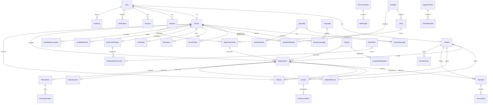

# Database

PostgreSQL 16 via Prisma 7. **45 models, 27 enums, 77 indexes, 37 unique constraints.**

Prisma 7 removed the Rust query engine, so the connection is supplied by the `@prisma/adapter-pg`
driver adapter and the connection URL lives in `prisma.config.ts`, not in `schema.prisma`.

## Conventions

| Rule | Reason |
| --- | --- |
| Money is `Int` in minor units (paisa/cents) | `Decimal` does not cross the RSC boundary; floats have no place in payments |
| All `DateTime` are UTC | Local time is derived from the owning doctor's/clinic's IANA `timezone` |
| Working hours are minutes from local midnight | The only representation that survives a DST transition |
| Soft delete (`deletedAt`) where audit matters | Users, doctors, patients, appointments, reviews, records |
| `@@map` to snake_case tables | Idiomatic SQL naming, idiomatic TS models |

## Entity relationship diagram



## Model groups

**Auth** — `User`, `Session`, `Account`, `Verification`. Better Auth's expected shape, extended
with `role`, `status`, `phone`, `timezone`, `failedLoginAttempts`, `lockedUntil`.

**Profiles** — `Patient`, `Doctor`, plus `Specialty` (self-referencing tree), `Language`,
`Hospital`, `Clinic` and the join tables `DoctorSpecialty`, `DoctorLanguage`, `DoctorClinic`,
`HospitalAffiliation`.

**Credentials** — `Education`, `Certificate`, `DoctorVerification`, `VerificationDocument`.

**Availability** — `AvailabilityRule` (recurring weekly), `AvailabilityException` (holiday or
extra session), `AppointmentSlot` (materialised, bookable).

**Booking** — `Appointment`, with a self-relation for reschedule chains
(`rescheduledFromId` → `rescheduledTo`).

**Money** — `Payment`, `Transaction`, `Invoice`, `InvoiceLineItem`, `Coupon`, `CouponRedemption`.

**Clinical** — `MedicalRecord`, `Prescription`, `PrescriptionItem`. Patient records are private
until `isSharedWithDoctor` is set.

**Engagement** — `Review`, `SavedDoctor`, `Notification`, `SupportTicket`, `TicketMessage`.

**AI** — `AiConversation`, `AiMessage`, `SymptomCheck`, `SymptomRule`.

**Platform** — `StoredFile`, `AuditLog`, `AdminLog`, `SystemSetting`.

## The constraint that prevents double-booking

```prisma
model AppointmentSlot {
  doctorId String
  startsAt DateTime
  mode     ConsultationMode
  status   SlotStatus @default(AVAILABLE)

  heldByUserId String?
  heldUntil    DateTime?

  @@unique([doctorId, startsAt, mode])   // one slot per doctor per instant per mode
  @@index([doctorId, startsAt, status])  // availability lookup
  @@index([status, heldUntil])           // expiry sweep
}
```

`(doctorId, startsAt, mode)` rather than `(doctorId, startsAt)` is deliberate: a doctor can
legitimately offer a video slot and an in-person slot at the same hour.

`heldByUserId`/`heldUntil` mirror the Redis hold so a sweep can reconcile after a Redis flush.
Redis remains the source of truth for the live countdown.

## Slot status machine

```
AVAILABLE ──hold──→ HELD ──confirm──→ BOOKED
    ↑                 │                  │
    └──expire/release─┘                  │
    └────────── cancel (if future) ──────┘

BLOCKED — set by the doctor; never bookable
```

## Appointment status machine

```
PENDING_PAYMENT ──paid──→ CONFIRMED ──start──→ IN_PROGRESS ──→ COMPLETED
      │                        │                                   │
      │                        ├──→ CANCELLED_BY_PATIENT           └──→ review
      │                        ├──→ CANCELLED_BY_DOCTOR
      │                        └──→ NO_SHOW
      └──timeout──→ EXPIRED
```

## Indexing strategy

Indexes exist for documented access paths, not speculatively.

| Index | Serves |
| --- | --- |
| `Doctor(verificationStatus, isAcceptingPatients)` | Marketplace visibility filter, applied to every public query |
| `Doctor(ratingAverage)`, `Doctor(yearsOfExperience)` | Sort orders |
| `Doctor(slug)` | Profile lookup |
| `AppointmentSlot(doctorId, startsAt, status)` | Availability panel — the hottest query |
| `AppointmentSlot(status, heldUntil)` | Expiry sweep |
| `Appointment(patientId, startsAt)` / `(doctorId, startsAt)` | Both appointment lists |
| `Appointment(status, startsAt)` | Reminder and expiry jobs |
| `Review(doctorId, status, createdAt)` | Published reviews on a profile |
| `AuditLog(entityType, entityId)` | "What happened to this record?" |
| `Notification(userId, readAt, createdAt)` | Unread badge |

Denormalised `Doctor.ratingAverage` / `ratingCount` / `completedAppointments` are recomputed on
write so the listing never aggregates per row.

## Migrations

```bash
npm run db:migrate            # create + apply in development
npm run db:migrate:deploy     # apply in production, no prompts
npm run db:reset              # drop, recreate, re-seed  (destroys data)
npm run db:studio             # browse
```

## Seed

`prisma/seed.ts` is idempotent — it truncates the tables it owns in FK-safe order, then inserts:

- 18 specialties, 6 languages, 7 hospitals, 12 clinics
- 12 doctors: 10 approved, 1 under review, 1 pending; one on vacation, one closed to new patients
- 2 admins, 3 patients
- Availability rules, and **slots generated by the real `generateSlots` function** — never
  hand-written rows, so the seed cannot drift from the booking engine
- Past completed appointments with payments and paid invoices, plus upcoming confirmed ones
- Published and pending reviews, one with a doctor reply
- 3 coupons (percentage, fixed, expired), 8 system settings, 21 triage rules

The triage rules are imported from `src/features/ai/data/symptom-rules.ts` — the same source the
offline assistant uses, so what the engine applies without a database is exactly what an
administrator later edits.
